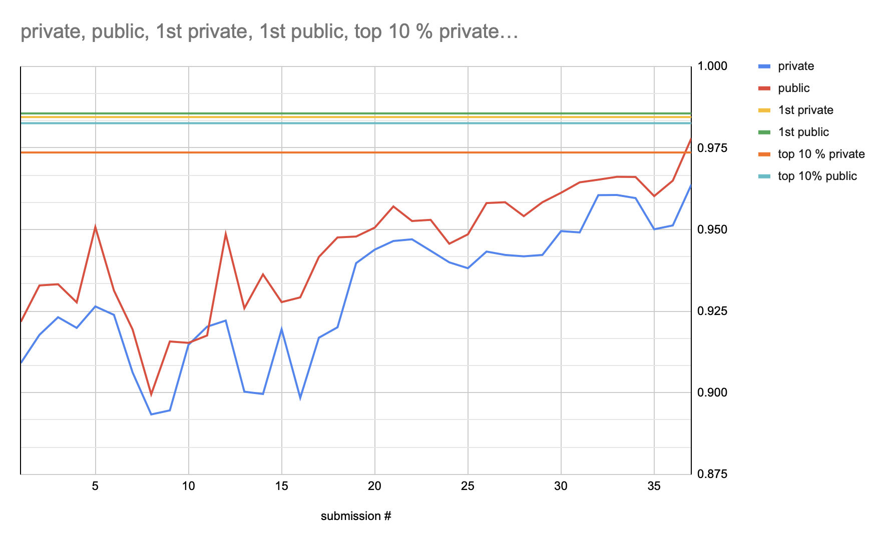
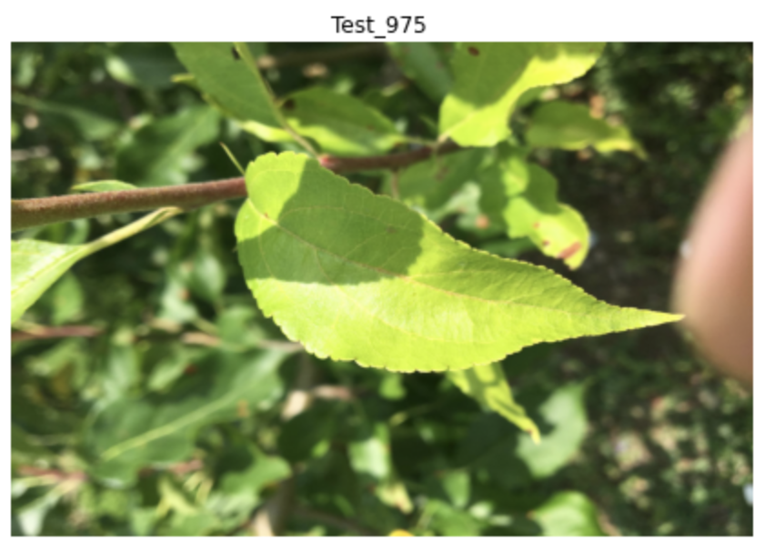
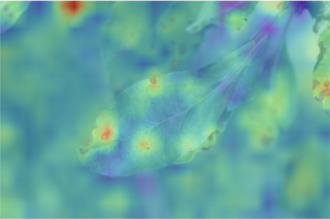

Competition: https://www.kaggle.com/c/plant-pathology-2020-fgvc7/overview

I worked on this for 2 weeks as part of the FastChai and Kaggle: Group based Projects https://forums.fast.ai/t/fastchai-and-kaggle-group-based-projects/81384 organized by Sanyam Bhutani.

I worked with Isaac Flath on this project - see his blog here: https://isaac-flath.github.io/blog

# Problem description
The goal of this competition is to classify plant images. There are 4 possible output:
- healthy
- scab
- rust
- multiple diseases

This is an image classification problem. Each image can only have 1 label.
The category 'multiple diseases' is largely under-represented.

There are 1821 train images, 1821 test images. Images are quite large (2048x1365)

Some examples:
## rust


## scab


## healthy


## multiple_diseases


# My score evolution
I worked 2 weeks on this competition.
If I work 2 more weeks, I should get a perfect score ;-)


My best score is: 0.96380 private, 0.97800 public.
That would give me rank #406 (out of 1317). Top 33%...

Top 10% threshold is 0.9736	private, 1st place solution achieved 0.98445 private.

I mostly looked at the 1st place solution for inspiration: https://www.kaggle.com/c/plant-pathology-2020-fgvc7/discussion/154056

# What worked
- seresnextnet50 as architecture
- larger images (320x512). I used batch size 16 to train on kaggle notebooks (bs=64 gives OOM)
- 5-fold stratified cross-validation
- augmentations (Rotate, Zoom, Warp, Brightness, Flip, Contrast, Resize, Normalize
- TTA
- LabelSmoothingCrossEntropy loss function
- generate 5 predictions from the 5-fold cross-validation and use rankdata to blend the submissions

# What was complicated
- some images are mislabeled -> what to do with these? ignore? change the label?
- some noisy labels as well (rust in the background of the healthy leaf)

- hard to manually label data when mislabeled - especially for the 'multi-disease' category
- ROC AUC metric on validation set is >0.999 on all folds -> hard to know what is helping before submitting

# What I tried
- pseudo labeling technique to augment the dataset (see https://isaac-flath.github.io/blog/deep%20learning/2020/11/26/Pseudo-Labeling.html)
- use soft labels and try to apply distilation knowledge
- use gradcam to visualize and interpret results




- oversampling the under-represented class ('multiple_disease'). This seemed to help the local score but didn't translate on the leaderboard.

# How I worked
- Kaggle kernels
- 5-fold cross validation in 1 notebook
- merge prediction in separate notebook (cross-validation output is saved as a new dataset)

# Some details

## Use seresnextnet50 as architecture
```python
!pip install -q pretrainedmodels
import pretrainedmodels
def model_f(pretrained=True,**kwargs):
    return pretrainedmodels.se_resnext50_32x4d(num_classes=1000,pretrained='imagenet')
learn = cnn_learner(dls, model_f, pretrained=True, 
                    loss_func=LabelSmoothingCrossEntropy(), metrics=[RocAuc(), error_rate])
```

## Use rankdata to blend the fold submissions
When running the cross validation, you generate predict for each fold.
Since the metric is AUC ROC, the only thing that matters is the order of the predictions.
Rankdata worked better than averaging the predictions. 

## Run a stratified K-fold cross-validation

Full code here: https://www.kaggle.com/hamonk/plant-pathology-fastai-seresnext50

```python
for fold in range(0,5):

    plant = DataBlock(blocks=(ImageBlock, CategoryBlock),
                      splitter=IndexSplitter(train[train['fold'] == fold].index),
                      get_x=ColReader('image_id', pref=path/"images", suff='.jpg'),
                      get_y=ColReader('label'),
                      item_tfms=Resize(R2),
                      batch_tfms=comp)

    dls = plant.dataloaders(train, bs=16)
    
    learn = cnn_learner(dls, model_f, pretrained=True, loss_func=LabelSmoothingCrossEntropy(), metrics=[RocAuc(), error_rate])
    
    print(f'-------- {fold} ---------')
    learn.fine_tune(10, base_lr=5e-2)    
    learn.unfreeze()    
    learn.fit_one_cycle(15, lr_max=slice(1e-7, 1e-4))    
    learn.save(f'seresnext50-fold-{fold}')

    # prediction test set
    tst_dl = dls.test_dl(test)    
    preds, _ = learn.tta(dl=tst_dl)
    
    cols=['image_id'] + list(dls.vocab)
    res = pd.concat([test, pd.DataFrame(preds,columns = learn.dls.vocab)],axis=1)[cols]
    res.to_csv(f'submission_tta_resnext_{fold}.csv',index=False)
    
    # prediction valiation set
    res = learn.get_preds()
    cols= dls.vocab
    r = pd.DataFrame(res[0], columns=cols)
    
    valid_with_preds = pd.concat([train[train['fold'] == fold].reset_index(), r], axis=1)
    
    # print metric for each column
    print(roc_auc_score(train[train['fold'] == fold][cols], r))
    
    for col in cols:
        score = roc_auc_score(train[train['fold'] == fold][col], r[col])
        print(f'{col} -> {score}')
        
    valid_with_preds.to_csv(f'validation_resnext_{fold}.csv',index=False)
```

## Pseudo-labeling as data augmentation technique

The idea is to use the test dataset at training time.

With the trained model, you run inference on the test data. For the images where you are confident, you integrate these images at training time.

The idea behind is that you might learn more about the structure of the images thanks to these additional images.

I tried this and it was a bit tedious because I manually reviewed the predictions before using them at training time.


## Use soft labels

In the 1st place solution, they used knowledge distillation and soft labels.

Thanks to my teammate Isaac Flath, I was able to implement a callback to do something similar.

This does not implement what the 1st place solution did exactly but I wanted to try this way as it sounded interested to try and code.

I trained 5-fold models and stored the validation prediction for each fold.
That gave me OOF predictions for the entire training set.

I then used this to generate soft labels: 0.7 * ground truth + 0.3 * model prediction
For example, if the truth is (0,1,0,0) and the prediction is (0,0,1,0), the label I used is (0,0.7,0.3,0).
This is similar to a MixUp augmentation technique.

I used Logsoftmax in the loss function.

In this code, train_with_preds is an dataframe with the soft labels for the whole entire training set.

```python
class MyMixUp(Callback):
    def __init__(self, train_with_preds): 
        # training data with soft predictions (0, 0.3, 0.7, 0)
        self.train_with_preds = train_with_preds
        # dictionary to help decode
        self.d={x:idx for idx,x in enumerate(['healthy', 'multiple_diseases', 'rust', 'scab'])}
        # columns with the soft values
        self.soft=[f'new_{x}' for x in ['healthy', 'multiple_diseases', 'rust', 'scab']]

    def before_batch(self):
        # get the idx from the dataloader
        self.idxs = self.dl._DataLoader__idxs
        # get the images' names for the current batch
        imgs = L(o for o in self.dl.items.iloc[self.idxs[self.iter*self.dl.bs:self.iter*self.dl.bs+self.dl.bs]].image_id)
        # get the soft label corresponding to each image
        df = self.train_with_preds.set_index('image_id').loc[imgs, self.soft]
        soft_labels = [tuple(x) for x in df.to_records(index=False)]
    
        # replace the targets with the soft targets
        self.learn.yb = (Tensor(soft_labels).cuda(),)

def MyLoss(output, target):
    return torch.mean(torch.sum(-target * nn.LogSoftmax(dim=-1)(output), -1))

learn1 = cnn_learner(dls, model_f, pretrained=True, 
                     loss_func=MyLoss, metrics=[mse, exp_rmspe],
                     cbs=MyMixUp(train_with_preds))
```

I am sure there are much better ways to do this but I was pretty happy to be able to modify the training loop this way.


# Paper to cite
https://arxiv.org/abs/2004.11958

